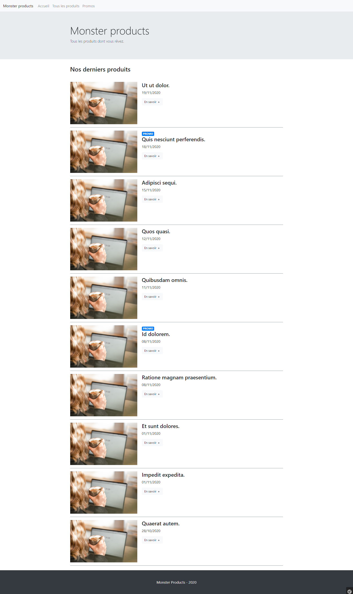
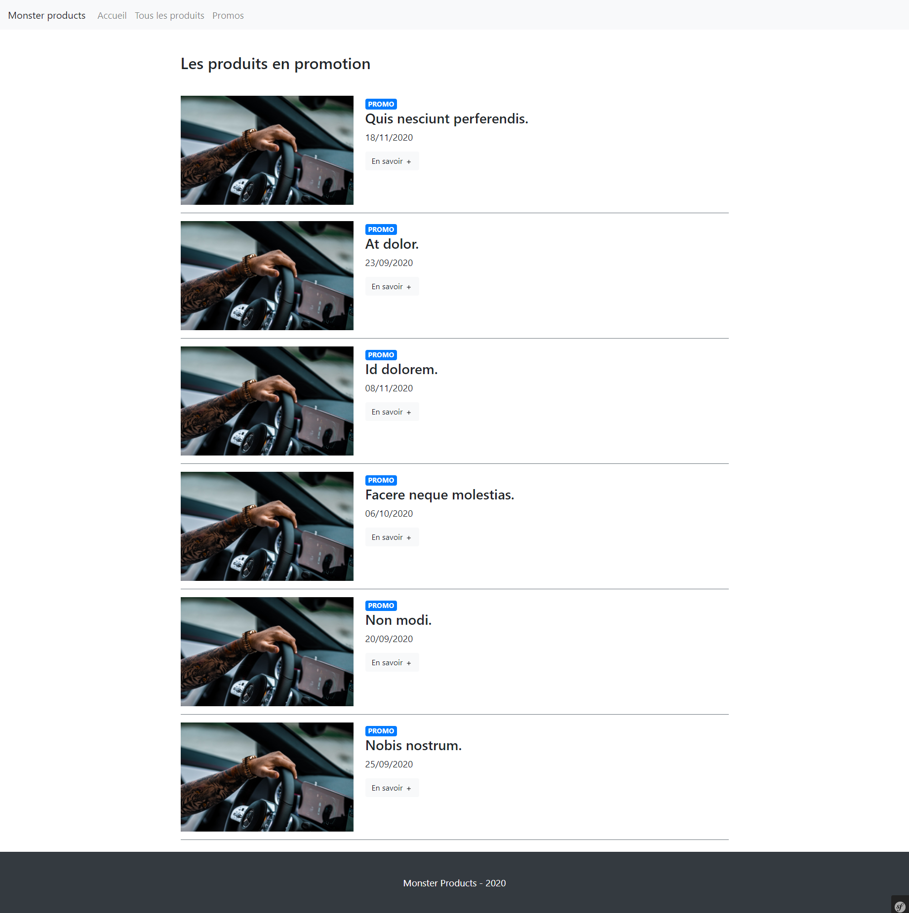
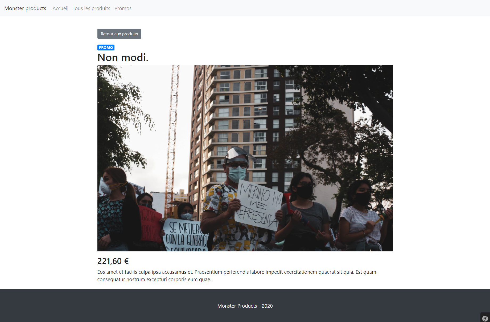

# Ynov - B2 - Symfony - DS 1

Vous allez réaliser un site simple présentant des produits.

## Règles imposées

- Utiliser la version 4.4 de Symfony
- Utiliser une librairie CSS type Bootstrap, UIKit, etc...
- Réaliser une application responsive

## Objectifs

- Identifier les dépendances requises
- Créer une entité
- Afficher une date avec un filtre Twig
- Afficher un nombre flottant avec Twig
- Séparer ses templates Twig, identifier l'arborescence de templates nécessaire
- Manipuler le QueryBuilder
- Tirer partie du repository pour adapter la requête voulue

## Structure d'un produit

|Champ|Type|Commentaire|
|---|---|---|
|id|int||
|name|string||
|description|text||
|image|string|L'illustration du produit|
|promo|boolean||
|display|boolean|_Afficher le produit ou non_|
|priceHT|float||
|created|date|_Date de création du produit_|

Vous organiserez vos fixtures pour avoir des données aléatoires et en nombre raisonnable (une vingtaine de produits au moins).

## Pages demandées

### Page d'accueil

La page d'accueil présentera les 10 derniers produits visibles (display : true), ordonnés par date décroissante

### Page tous les produits

La page tous les produits aura la même apparence que la page d'accueil, sans la bannière d'accueil, et présentera tous les produits visibles, sans ordre particulier

### Page promos

La page "Promos" présentera tous les produits en promotion

### Page produit

Une page de produit présentera les détails d'un produit

